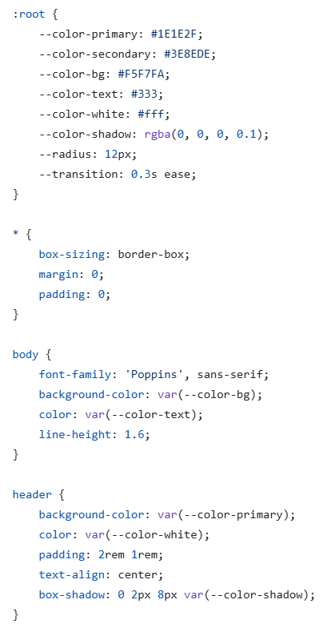

# IFTS Nº29 - Desarrollo de Sistemas Web (Front End)
## Práctica Formativa Obligatoria: Landing Page de Portafolio Personal (HTML y CSS)

GitHub Pages: https://mirtaveron.github.io/ifts29-frontend-2025-tp2/

**Punto 1 - Funcionalidades con JavaScript**  
Se deberán implementar un mínimo de 5 funcionalidades con JavaScript, elegidas entre las opciones sugeridas o cualquier otra que el estudiante desee sumar.
Funciones sugeridas: 
1. **Validación de Formulario:** [✔] 
    * Validar los campos obligatorios del formulario de contacto (Nombre, Apellido, Email, Teléfono) antes de enviarlo. 
    * Mostrar mensajes de error si algún campo está incompleto.     
2. **Modo Oscuro/Claro:** [✔] 
    * Implementar un botón o switch que permita alternar entre los modos oscuro y claro de la página.
    * Recordar la preferencia del usuario utilizando LocalStorage.
3. **Pop-up de Confirmación de Envío:** [✔] 
    * Mostrar un pop-up que indique que el formulario se envió correctamente.
4. **Ocultar y/o Mostrar Contenido:** [✔] 
    * Crear un botón que permita ocultar o mostrar contenido en cualquier sección, como en la presentación personal o las tarjetas.
5. **Galería de Imágenes:** [✔]
    * Implementar una galería dinámica con imágenes que se puedan navegar (por ejemplo, utilizando flechas para avanzar o retroceder).
6. **Creación de Contenido Dinámico:** [✔]
    * Generar dinámicamente las tarjetas, el listado de habilidades o las películas favoritas utilizando datos de un array en JavaScript.
7. **Filtros en el Contenido:** [✔]
    * Crear un sistema de filtros (por ejemplo, en la galería de imágenes o las tarjetas) para mostrar contenido específico según ciertas categorías.
8. **Temporizador o Reloj:** [✔]
    * Incluir un temporizador que indique el tiempo restante para la entrega del trabajo práctico.
9. **Contador de Visitas:** [✔]
    * Implementar un contador de visitas a la página utilizando JavaScript y LocalStorage.
10. **Animaciones Dinámicas:** [✔]
    * Usar JavaScript para agregar animaciones a elementos específicos, como las tarjetas o los botones.

A continuación, se describe brevemente cómo se implementó cada una de las 10 funcionalidades y se justifica la elección de cada una:

• **Validación de Formulario**:
Se agregó un evento "submit" al formulario de contacto que ejecuta una función de validación. Dicha función verifica que los campos obligatorios (nombre, apellido, email y teléfono) no estén vacíos y que el email y el teléfono tengan un formato válido. En caso de errores, se muestran mensajes de error debajo de cada campo.  
Justificación: La validación de formularios es fundamental para garantizar que los usuarios ingresen información correcta y completa, lo que mejora la experiencia de envío y evita errores posteriores.

• **Modo Oscuro/Claro**:
Se agregó un botón en el encabezado que alterna entre el modo oscuro y claro. Al hacer clic en el botón, se aplica o se quita la clase "modo-oscuro" al elemento <body>, lo que cambia los estilos correspondientes. La preferencia del usuario se guarda en el localStorage para que se mantenga al recargar la página.  
Justificación: Ofrecer un modo oscuro/claro permite que los usuarios puedan adaptar la apariencia del sitio web a sus preferencias, lo que mejora la accesibilidad y la comodidad visual. 

• **Pop-up de Confirmación de Envío**: 
Cuando el formulario de contacto se envía correctamente, se muestra un modal (pop-up) con un mensaje de confirmación. El modal se oculta inicialmente con la clase "oculto" y se muestra o se oculta mediante la manipulación de dicha clase.  
Justificación: Mostrar una confirmación visual del envío exitoso del formulario brinda una experiencia de usuario más satisfactoria y le asegura la finalización de un proceso. 

• **Ocultar y/o Mostrar Contenido:** 
Se agregaron botones "Ocultar" en las secciones del sitio web. Al hacer clic en estos botones, se agrega o se quita la clase "oculto" del elemento correspondiente, ocultando o mostrando su contenido.  
Justificación: Permitir ocultar y mostrar contenido en diferentes secciones mejora la organización y la presentación de la información, facilitando la navegación y la exploración del contenido por parte del usuario.

• **Galería de Imágenes:** 
Se creó una galería de imágenes con un carrusel que permite navegar entre las diferentes imágenes. Se utilizan botones de "Anterior" y "Siguiente" para controlar la navegación, y se muestra una miniatura de cada imagen para facilitar la selección.  
Justificación: Una galería dinámica de imágenes enriquece la experiencia del usuario y hace que el sitio web sea más atractivo e interactivo.

• **Creación de Contenido Dinámico:** 
Se crearon arrays en JavaScript para almacenar los datos de los proyectos, habilidades y películas favoritas. Estos datos se utilizan para generar dinámicamente las tarjetas, la lista de habilidades y las películas en el sitio web.  
Justificación: Generar el contenido de manera dinámica a partir de datos en JavaScript permite una mayor flexibilidad y facilidad de mantenimiento, ya que se puede actualizar el contenido sin tener que modificar el código HTML.

• **Filtros en el Contenido:** 
Se agregaron botones de filtro en la sección de la galería de imágenes. Al hacer clic en estos botones, se filtra el contenido de la galería mostrando solo las imágenes que coinciden con la categoría seleccionada.    
Justificación: Implementar un sistema de filtros permite a los usuarios encontrar y acceder más fácilmente a la información que les interesa, mejorando la navegabilidad y la experiencia general del sitio web.

• **Temporizador o Reloj:** 
Se agregó un elemento en el encabezado del sitio web que muestra un temporizador que cuenta el tiempo restante hasta la fecha de entrega del trabajo práctico. El temporizador se actualiza cada segundo utilizando setInterval().  
Justificación: Incluir un temporizador visible proporciona una referencia visual importante para el usuario, ayudándolo a mantenerse informado y consciente del plazo de entrega.

• **Contador de Visitas:** 
Se agregó un elemento en el pie de página que muestra el número de visitas al sitio web. El contador se incrementa cada vez que se carga la página y se almacena en el localStorage para mantener el registro de visitas.  
Justificación: Implementar un contador de visitas permite al usuario y al desarrollador tener una idea del interés y la actividad en el sitio web, lo que puede ser útil para fines de análisis y seguimiento.

• **Animaciones Dinámicas:** 
Se agregaron animaciones a los botones "Ocultar" utilizando JavaScript. Cuando se hace clic en los botones "Ocultar", se aplica una animación de rebote.  
Justificación: Agregar animaciones dinámicas mejora la apariencia visual del sitio web, aumenta la interactividad y la sensación de fluidez, lo que contribuye a una experiencia de usuario más atractiva y que recordará mejor.  

**Punto 2 - Mejoras o Cambios en el Diseño y Código**  
Identificar al menos dos mejoras en el diseño, la estructura o los estilos del trabajo anterior. 

1. **Mejor contraste y legibilidad: Ajustes en la paleta de colores y tipografía para facilitar la lectura.** 

**Cambio realizado:**  
• Se agregó la opción de ver el sitio en 'Modo oscuro'.  
• Esto mejorar la accesibilidad y la experiencia del usuario, especialmente en entornos con poca iluminación.  
 
**Mejora en la experiencia del usuario:** Se brinda a los usuarios una experiencia mejorada y adaptada a diferentes preferencias y entornos de visualización.  
 
2. **Mejor estructuración del código CSS: Separar estilos en secciones organizadas para facilitar la edición.**   
  
**Cambio realizado:**   
• Se crearon secciones separadas para estilos como el encabezado, la navegación, los artículos, los formularios, la galería de imágenes, etc. Los estilos que pertenecen a un mismo elemento o funcionalidad se agruparon juntos, lo que evita la dispersión y la repetición de código.   
• Se utilizaron nombres de clases y secciones más descriptivos y estructurados, lo que facilita la búsqueda y la ubicación de los estilos específicos.   
   
**Mejora en la experiencia del usuario:** Al tener el código CSS organizado y modularizado, es más sencillo encontrar y editar los estilos específicos que necesitan ser modificados. La división en secciones y la nomenclatura clara mejoran la legibilidad del código, lo que facilita la comprensión del mismo por parte de otros desarrolladores. 

A continuación, se muestran capturas de pantalla que ilustran las mejoras realizadas: 

**Diseño anterior:** 

 
 
 

**Diseño actualizado:** 
 
 

 
 

